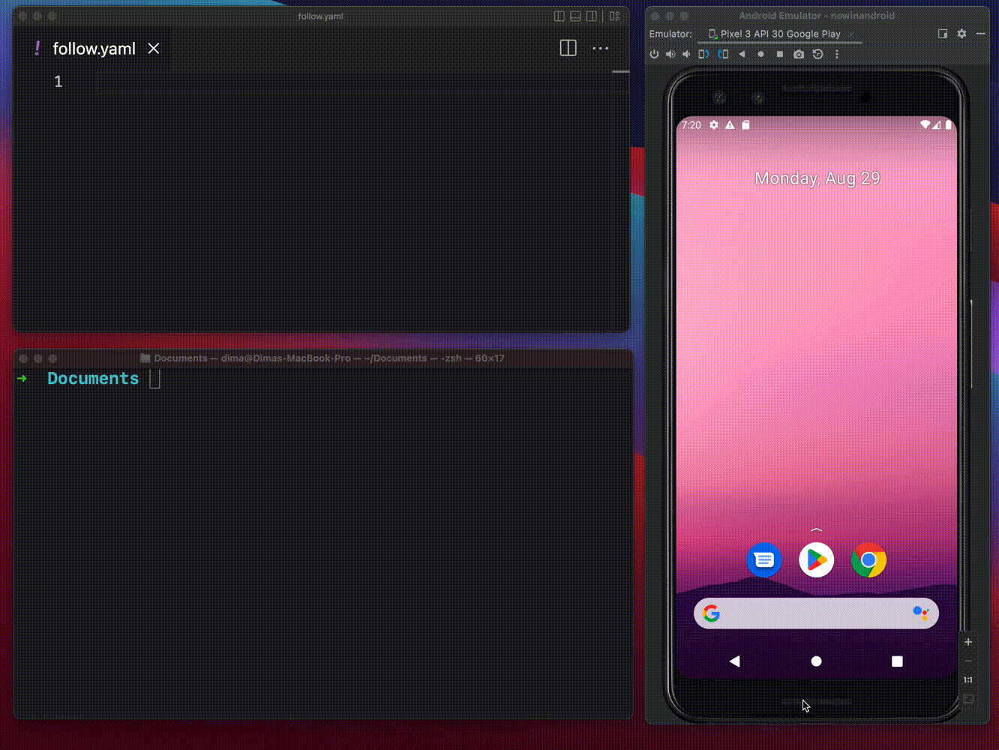

<h1 align="center">
  <br>
  <a href="http://www.amitmerchant.com/electron-markdownify"></a>
  <br>
  qa-mobile-maestro
  <br>
</h1>

<h4 align="center">Proyecto base de <a href="https://maestro.mobile.dev/getting-started/installing-maestro" target="_blank">Pragma</a>.</h4>


<p align="center">
  <a href="https://ubuntu.com/desktop/wsl">
   
  </a>

  <a href="https://maestro.mobile.dev/getting-started/installing-maestro">
   
  </a>
  
  <a href="https://developer.android.com/studio?hl=es-419">
   

  </a>
  
</p>

Este repositorio contiene un proyecto de automatización de pruebas para aplicaciones móviles utilizando Maestro, 
una herramienta de código abierto para la automatización de flujos de trabajo en dispositivos móviles. 
Maestro permite realizar pruebas funcionales y de interfaz de usuario de manera eficiente y sencilla en aplicaciones Android e iOS.

<p align="center">
  <a href="#topicos">Topicos</a> •
  <a href="#tecnologias">Tecnologias</a> •
  <a href="#consideraciones">Consideraciones</a> •
  <a href="#descarga">Descarga</a> •
  <a href="#instalación-y-ejecución">Instalación y ejecución</a> •
  <a href="#autores">Autores</a> •
</p>



## Topicos

* Yaml
* Ubuntu
* Maestro
* Javascript
* Android

## Tecnologias
### This project required:
- [JDK java] version 11
- [wsl] Ubuntu 22.04.4
- [maestro] last version

Nota: 
*   Es necesario tener un dispositivo móvil físico (Android) o un emulador/simulador (Android/IOS) configurado correctamente.
  
## Consideraciones
- Para usar el emulador que tenemos dentro de windows en Wsl (Ubuntu) necesitaremos ejecutar este comando en la terminal de windows 
```bash
# WSL (Ubuntu)
export ADB_SERVER_SOCKET=tcp:192.168.1.37:5037
```
- Y tambien en ubuntu ejecutar este comando
```bash
# Powershell (Windows)
adb -a -P 5037 nodaemon server  
```
## Descarga
Para clonar está aplicación desde la linea de comando:

```bash
git clone https://github.com/somospragma/qa-mobile-maestro.git
git remote remove origin
git remote add origin URL_DE_TU_NUEVO_REPOSITORIO
git push -u origin master
```
Nota: Asegúrate de reemplazar URL_DE_TU_NUEVO_REPOSITORIO con la URL del repositorio que creaste en tu cuenta de GitHub.

## Instalación y ejecución

Para ejecutar está aplicación, necesitas [Maestro](https://maestro.mobile.dev/getting-started/installing-maestro) y [Ubuntu](https://ubuntu.com/desktop/wsl) instalados en tu equipo.
Desde la linea de comando:

```bash
#Maestro
curl -Ls "https://get.maestro.mobile.dev" | bash

#Wsl - Ubuntu
wsl --install
```

##  🛠️ Run tests:
```
maestro --udid=<nombre-emulador>  --host <ip> test <nombre_archivo_test>.yaml
```

## Autores


| [<br><sub>Mauro L. Ibarra P.</sub>](https://gitlab.com/mauro.ibarrap) <br/> | [<br><sub>Marcos Silva</sub>](https://gitlab.com/) | 
:------------------------------------------------------------------------------------------------------------------------------------------------------------------------------:|:---------------------------------------------------------------------------------------------------------------------------------------------------------------------------:|

